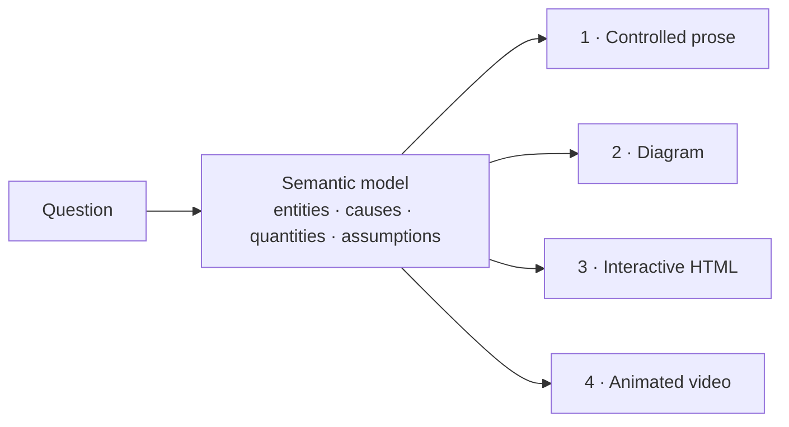

# Explainer

**An explanation compiler for Claude Code.** Ask a question. The agent builds a small semantic model of the subject, then compiles it into the simplest representation that keeps the important structure: controlled prose, a diagram, an interactive page, or a 3Blue1Brown-style video with synchronized narration.

The video pipeline runs on one machine: Manim for animation, a local Kokoro voice, and no API keys.

**[Live site: videos and interactive demo](https://ifrit98.github.io/Explainer/)** · Inspired by [Andrej Karpathy's post](https://x.com/karpathy/status/2105819303471976479) on understanding LLM output through richer formats.

<p align="center">
  <a href="explainers/softmax-temperature/video/out.mp4"></a>
  <br>
  <sub>From <a href="explainers/softmax-temperature/"><code>softmax-temperature</code></a>. One value, T, drives every object. <a href="explainers/softmax-temperature/video/out.mp4">Full video with narration (64 s)</a>.</sub>
</p>

## Inspiration

This project started from [a post by Andrej Karpathy](https://x.com/karpathy/status/2105819303471976479) (October 2026). The post proposes a ladder of output formats for understanding what language models produce, with each rung "even better" than the last:

1. **Writing** in ASD-STE100, softened to "80% of the way" because the spec is strict. Here: **STE-80**.
2. **Diagrams** instead of prose. Here: Stage 2.
3. **Web pages**: ask for output "in HTML" to get an interactive page. Here: Stage 3.
4. **Explainer videos**: "Create a 3b1b style video explainer on X", narrated with a TTS API key or a free local alternative. Here: Stage 4, with a local Kokoro voice.

The post's closing point is the project's premise: as code gets cheap, it makes sense to ask for "large, custom, discardable software artifacts" that would never have been worth building before. Explainer turns the ladder into a workflow. It builds one semantic model, chooses the lowest rung that keeps the structure, and keeps every rendering consistent with the model.

## Why

The usual workflow writes one explanation in one format. If you later add a diagram or a demo, each one is a new interpretation, and the versions drift apart.

Explainer separates **reasoning about the subject** from **rendering the explanation**:



Each rendering is compiled from the same `model.md`, so every rendering uses the same terms and numbers. Richer media are used only when they remove mental work.

| Stage | Use when the subject is mainly… | Escalate when… |
|---|---|---|
| **1 · Prose** | a procedure, a definition, an argument | — |
| **2 · Diagram** | topology, flow, architecture | the reader must hold 3+ relationships at once |
| **3 · Interactive** | a parameter, scenarios, drill-down | the reader must explore states or alternatives |
| **4 · Video** | a transformation over time | understanding depends on seeing A become B |

If five sentences explain it, the answer is five sentences.

## Examples

| | |
|---|---|
| [](https://ifrit98.github.io/Explainer/explainers/softmax-temperature/) | **[Softmax temperature](explainers/softmax-temperature/)**: the compiler demo, including why softmax uses exp (try dividing by the sum instead: owl gets −0.4). One model rendered as [prose](explainers/softmax-temperature/explanation.md), [diagrams](explainers/softmax-temperature/diagram.md), an [interactive page](https://ifrit98.github.io/Explainer/explainers/softmax-temperature/) (slider, sampler, assumption toggle), and a [narrated video](explainers/softmax-temperature/video/out.mp4) with a predict pause. |
| [](explainers/odd-squares/video/out.mp4) | **[Odd numbers make squares](explainers/odd-squares/)** (Stage 4, proof): each odd number is an L that grows the square by one size. LaTeX on screen, then a pause to predict the sum of the first ten odd numbers. |
| [](explainers/dijkstra/video/out.mp4) | **[Dijkstra's shortest paths](explainers/dijkstra/)** (Stage 4, algorithm): the run in `model.yaml`, replayed step by step. B is first reached at 4 and improved to 3. Shows why the smallest estimate is settled first, why a settled distance is final (with this run's numbers), and a negative edge that breaks it. [Blind-test results](explainers/dijkstra/review/understanding.md). |
| **[Why a CDN makes a request faster](https://ifrit98.github.io/Explainer/explainers/cdn-request/)** (Stage 3) | Two distance sliders and three paths side by side (no CDN, miss, hit). The instrument opens only after you predict the no-CDN time. Four levels, from the path to cache keys and TTL. |
| [](explainers/ste-80/video/out.mp4) | **[STE-80 rewrite](explainers/ste-80/)** (Stage 4): one manual sentence through three Simplified Technical English rules, 16 → 9 words. Kept words move; removed words fade. |
| **[git bisect](explainers/git-bisect/explanation.md)** (Stage 1) · **[git objects](explainers/git-objects/diagram.md)** (Stage 2) | The router at work: a procedure gets numbered steps; pure topology gets one diagram. |

All examples, with the reason for each stage: [`explainers/`](explainers/). The interactive pages and videos are live at **[ifrit98.github.io/Explainer](https://ifrit98.github.io/Explainer/)**.

## Install

In Claude Code:

```text
/plugin marketplace add ifrit98/Explainer
/plugin install explainer@explainer
```

Then ask:

```text
/explainer:explain how does a bloom filter work
/explainer:video why the derivative of sin is cos
/explainer:verify bloom-filter
```

The plugin adds an `explainer` command that runs the toolkit through [uv](https://docs.astral.sh/uv/). Video also needs Cairo, Pango, and FFmpeg (`brew install cairo pango pkgconf ffmpeg`) and a one-time `explainer setup` for the local voice. Details: [getting started](docs/getting-started.md).

## Checked, not trusted

Every explainer has a `model.yaml` next to its `model.md`. The renderings are held to it:

```bash
explainer check                 # a number a reader sees that the model lacks → fail
explainer render dijkstra --review   # video + review sheet; overlapping or off-frame text is reported
explainer quiz dijkstra --rendering video   # prompt for a blind reviewer that sees only the video
```

- **`check`** fails on a visible number the model does not contain, a required value a rendering omits, a page with a stale copy of the model, or an idea the explanation leaves out: every claim in the model needs its evidence (a why needs the simpler alternative failing; a guarantee needs a case where it breaks), and every rendering must cover its claims. Scenes and pages can read the model directly, so they cannot drift.
- **`probe`** gives the model to a fresh agent before anything is rendered, to find what is missing. It found that the first softmax explanation never said why it uses exp.
- **`review`** puts a frame from each narration line, bookmark, and predict pause on one sheet, with the spoken words under it. Scenes report text that overlaps, is covered, or leaves the frame.
- **`quiz`** gives a fresh agent one rendering and asks what it understood. The first run passed the published softmax prose and failed a deliberately broken copy.

## What is in the box

| | |
|---|---|
| **Plugin** · [`plugin/`](plugin/) | Skills [`explain`](plugin/skills/explain/SKILL.md), [`video`](plugin/skills/video/SKILL.md), [`verify`](plugin/skills/verify/SKILL.md); the [principles](plugin/skills/explain/references/principles.md); playbooks for [writing](plugin/skills/explain/references/writing.md), [diagrams](plugin/skills/explain/references/diagrams.md), [HTML](plugin/skills/explain/references/html.md), and [video](plugin/skills/explain/references/video.md). |
| **Toolkit** · [`explainer_kit/`](explainer_kit/) | The `explainer` CLI, the model check, `ExplainerScene` (voice sync, timeline, layout check, predict pauses), reusable components, word morphs, the Stage 3 web toolkit, and templates. |
| **Docs** · [`docs/`](docs/README.md) | [Getting started](docs/getting-started.md), [concepts](docs/concepts.md), [authoring guide](docs/authoring.md), [model reference](docs/model-reference.md), [video pipeline](docs/video-pipeline.md), [web toolkit](docs/web-toolkit.md), [CLI](docs/cli.md), [troubleshooting](docs/troubleshooting.md). |

### Narration that drives the animation

```python
class Softmax(ExplainerScene):
    def construct(self):
        T = ValueTracker(1.0)   # drives the dots, bars, and numbers
        ...
        self.predict("When T rises to 2, does cat stay the most likely token?")
        with self.voiceover(text="Now raise the temperature. <bookmark mark='hot'/> At T equal to two, "
                                 "the logits move together."):
            self.wait_until_bookmark("hot")
            self.play(T.animate.set_value(2.0), run_time=3)
```

The animation starts exactly when the voice reaches the bookmark. Local TTS engines give no word timings, so the usual fix is a second pass with Whisper. Here the Kokoro service synthesizes each sentence and each bookmark segment separately and records where each one starts, so bookmark and caption times are exact. `self.predict` dims the frame and asks a question; web players stop there until the viewer commits a prediction. [How it works](docs/video-pipeline.md).

## Writing style: STE-80

Prose and narration use STE-80, a house style based on [ASD-STE100](https://www.asd-ste100.org/). It applies about 80% of the rules and skips the dictionary check.

> ~~It is imperative that the operator ensures the hydraulic reservoir is replenished prior to commencing operation.~~
> Fill the hydraulic reservoir before you start the machine.

One idea per sentence, active voice, one term per concept, and direct causal statements ("A causes B because C"). [Rules](plugin/skills/explain/references/writing.md).

## Requirements

- [Claude Code](https://claude.com/claude-code) for the agent workflow (Stages 1–4).
- For video: Python 3.11–3.13 via `uv`, Cairo, Pango, pkg-config, FFmpeg. Optional: SoX; LaTeX for `MathTex` (a user-level TinyTeX works; see [troubleshooting](docs/troubleshooting.md)).
- Tested on macOS (Apple silicon). Linux should work with the same libraries.

## Related

- [showtime](https://github.com/FavioVazquez/showtime): a broader local video studio plugin for coding agents (HTML motion graphics, footage editing, music). It works alongside this repo; see [video playbook §7](plugin/skills/explain/references/video.md#7-optional-showtime).
- [Manim Community](https://www.manim.community/) · [manim-voiceover](https://github.com/ManimCommunity/manim-voiceover) · [Kokoro-82M](https://huggingface.co/hexgrad/Kokoro-82M)

## Roadmap

What is done, what is next, and what the reviews found: [ROADMAP.md](ROADMAP.md). Release notes: [CHANGELOG.md](CHANGELOG.md). Contributing: [CONTRIBUTING.md](CONTRIBUTING.md).

## License

[MIT](LICENSE). Third-party components keep their own licenses: Manim and manim-voiceover (MIT), Kokoro-82M weights (Apache-2.0), kokoro-onnx (MIT), FFmpeg (LGPL/GPL). The Kokoro model files are downloaded by `explainer setup` and are not part of this repository.
