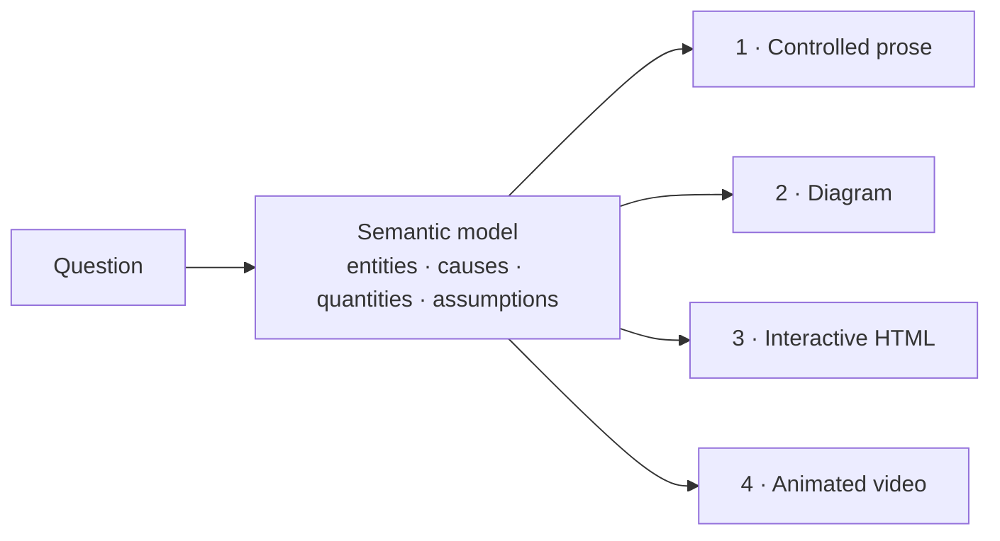

# Explainer

**An explanation compiler for Claude Code.** Ask a question. The agent builds a small semantic model of the subject, then compiles it into the simplest representation that keeps the important structure: controlled prose, a diagram, an interactive page, or a 3Blue1Brown-style video with synchronized narration.

The video pipeline runs on one machine: Manim for animation, a local Kokoro voice, and no API keys.

**[Live site: videos and interactive demo](https://ifrit98.github.io/Explainer/)** · Inspired by [Andrej Karpathy's post](https://x.com/karpathy/status/2105819303471976479) on understanding LLM output through richer formats.

<p align="center">
  <a href="explainers/softmax-temperature/video/out.mp4"></a>
  <br>
  <sub>From <a href="explainers/softmax-temperature/"><code>softmax-temperature</code></a>. One value, T, drives every object. <a href="explainers/softmax-temperature/video/out.mp4">Full video with narration (64 s)</a>.</sub>
</p>

## Inspiration

This project started from [a post by Andrej Karpathy](https://x.com/karpathy/status/2105819303471976479) (October 2026). The post proposes a ladder of output formats for understanding what language models produce, with each rung "even better" than the last:

1. **Writing** in ASD-STE100, softened to "80% of the way" because the spec is strict. Here: **STE-80**.
2. **Diagrams** instead of prose. Here: Stage 2.
3. **Web pages**: ask for output "in HTML" to get an interactive page. Here: Stage 3.
4. **Explainer videos**: "Create a 3b1b style video explainer on X", narrated with a TTS API key or a free local alternative. Here: Stage 4, with a local Kokoro voice.

The post's closing point is the project's premise: as code gets cheap, it makes sense to ask for "large, custom, discardable software artifacts" that would never have been worth building before. Explainer turns the ladder into a workflow. It builds one semantic model, chooses the lowest rung that keeps the structure, and keeps every rendering consistent with the model.

## Why

The usual workflow writes one explanation in one format. If you later add a diagram or a demo, each one is a new interpretation, and the versions drift apart.

Explainer separates **reasoning about the subject** from **rendering the explanation**:



Each rendering is compiled from the same `model.md`, so every rendering uses the same terms and numbers. Richer media are used only when they remove mental work.

| Stage | Use when the subject is mainly… | Escalate when… |
|---|---|---|
| **1 · Prose** | a procedure, a definition, an argument | — |
| **2 · Diagram** | topology, flow, architecture | the reader must hold 3+ relationships at once |
| **3 · Interactive** | a parameter, scenarios, drill-down | the reader must explore states or alternatives |
| **4 · Video** | a transformation over time | understanding depends on seeing A become B |

If five sentences explain it, the answer is five sentences.

## Examples

| | |
|---|---|
| [](https://ifrit98.github.io/Explainer/explainers/softmax-temperature/) | **[Softmax temperature](explainers/softmax-temperature/)**: the compiler demo. One model rendered as [prose](explainers/softmax-temperature/explanation.md), [diagrams](explainers/softmax-temperature/diagram.md), an [interactive page](https://ifrit98.github.io/Explainer/explainers/softmax-temperature/) (slider, sampler, assumption toggle), and a [narrated video](explainers/softmax-temperature/video/out.mp4). |
| [](explainers/ste-80/video/out.mp4) | **[STE-80 rewrite](explainers/ste-80/)** (Stage 4): one manual sentence goes through three Simplified Technical English rules, 16 → 9 words. Kept words move; removed words fade. The narration is itself in STE. |
| **[git bisect](explainers/git-bisect/explanation.md)** (Stage 1) | A procedure, so the router picks numbered steps and stops there. |
| **[git objects](explainers/git-objects/diagram.md)** (Stage 2) | Pure topology (blobs, trees, commits, refs), so the router picks one diagram. |

All examples, with the reason for each stage: [`explainers/`](explainers/).

## Quick start

```bash
git clone https://github.com/ifrit98/Explainer.git && cd Explainer
brew install uv cairo pango pkgconf ffmpeg sox   # Linux: see docs/getting-started.md
uv sync
uv run explainer setup                           # downloads the Kokoro voice (~350 MB)
claude                                           # start Claude Code here
```

Then, in Claude Code:

```text
/explain how does a bloom filter work
/video why the derivative of sin is cos
```

Or use the video toolkit directly:

```bash
uv run explainer new my-topic              # scaffold model, storyboard, scene
uv run explainer render my-topic --draft   # fast silent layout pass
uv run explainer render my-topic           # 1080p60, voice, captions, contact sheet
```

## What is in the box

| | |
|---|---|
| **Workflow rules** · [`CLAUDE.md`](CLAUDE.md) | Model first, escalation protocol, STE-80 writing, epistemic labels, understanding test. Loaded in every session. |
| **Skills** · [`/explain`](.claude/skills/explain/SKILL.md), [`/video`](.claude/skills/video/SKILL.md) | The pipeline, and playbooks for [writing](.claude/skills/explain/references/writing.md), [diagrams](.claude/skills/explain/references/diagrams.md), [HTML](.claude/skills/explain/references/html.md), and [video](.claude/skills/explain/references/video.md). |
| **Video toolkit** · [`explainer_kit/`](explainer_kit/) | `ExplainerScene`, semantic colors, word-level text morphs, a Kokoro speech service with exact bookmark timing, and the `explainer` CLI. |
| **Docs** · [`docs/`](docs/) | For people: [getting started](docs/getting-started.md), [concepts](docs/concepts.md), [video pipeline](docs/video-pipeline.md), [CLI](docs/cli.md), [troubleshooting](docs/troubleshooting.md). |

### Narration that drives the animation

```python
class Softmax(ExplainerScene):
    def construct(self):
        T = ValueTracker(1.0)   # drives the dots, bars, and numbers
        ...
        with self.voiceover(text="Temperature divides every logit. <bookmark mark='cold'/> "
                                 "At T equal to one half, the logits move apart."):
            self.wait_until_bookmark("cold")
            self.play(T.animate.set_value(0.5), run_time=2.5)
```

The animation starts exactly when the voice reaches the bookmark. Local TTS engines give no word timings, so the usual fix is a second pass with Whisper. Here the Kokoro service synthesizes each bookmark segment separately and records where each one starts, so the times are exact. The render step joins the scenes, masters the audio to -16 LUFS, adds soft captions split at sentence boundaries, and writes a contact sheet of frames for review. [How it works](docs/video-pipeline.md).

## Writing style: STE-80

Prose and narration use STE-80, a house style based on [ASD-STE100](https://www.asd-ste100.org/). It applies about 80% of the rules and skips the dictionary check.

> ~~It is imperative that the operator ensures the hydraulic reservoir is replenished prior to commencing operation.~~
> Fill the hydraulic reservoir before you start the machine.

One idea per sentence, active voice, one term per concept, and direct causal statements ("A causes B because C"). [Rules](.claude/skills/explain/references/writing.md).

## Requirements

- [Claude Code](https://claude.com/claude-code) for the agent workflow (Stages 1–4).
- For video: Python 3.11–3.13 via `uv`, Cairo, Pango, pkg-config, FFmpeg. Optional: SoX; LaTeX for `MathTex`.
- Tested on macOS (Apple silicon). Linux should work with the same libraries.

## Related

- [showtime](https://github.com/FavioVazquez/showtime): a broader local video studio plugin for coding agents (HTML motion graphics, footage editing, music). It works alongside this repo; see [video playbook §7](.claude/skills/explain/references/video.md#7-optional-showtime).
- [Manim Community](https://www.manim.community/) · [manim-voiceover](https://github.com/ManimCommunity/manim-voiceover) · [Kokoro-82M](https://huggingface.co/hexgrad/Kokoro-82M)

## License

[MIT](LICENSE). Third-party components keep their own licenses: Manim and manim-voiceover (MIT), Kokoro-82M weights (Apache-2.0), kokoro-onnx (MIT), FFmpeg (LGPL/GPL). The Kokoro model files are downloaded by `explainer setup` and are not part of this repository.
