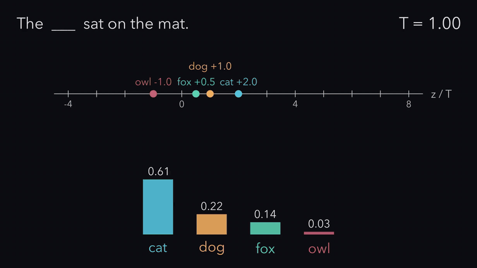
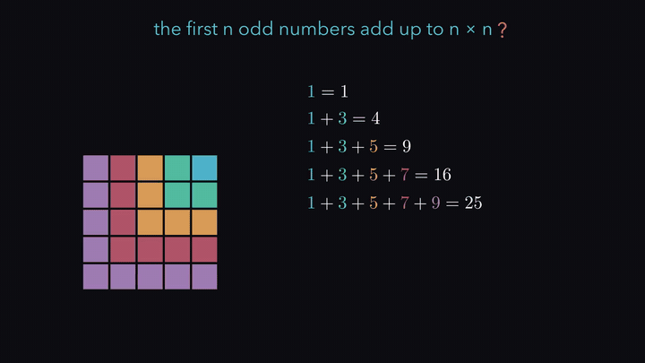
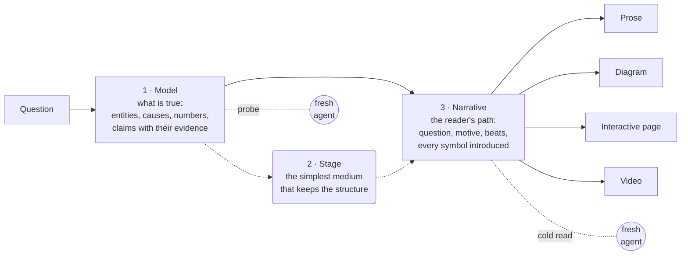
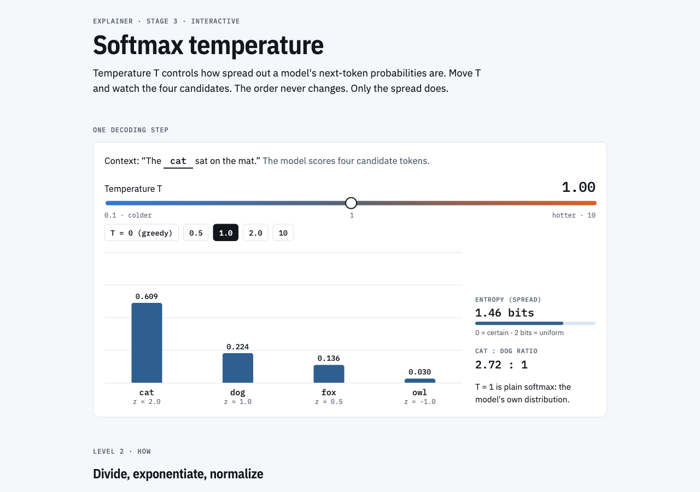
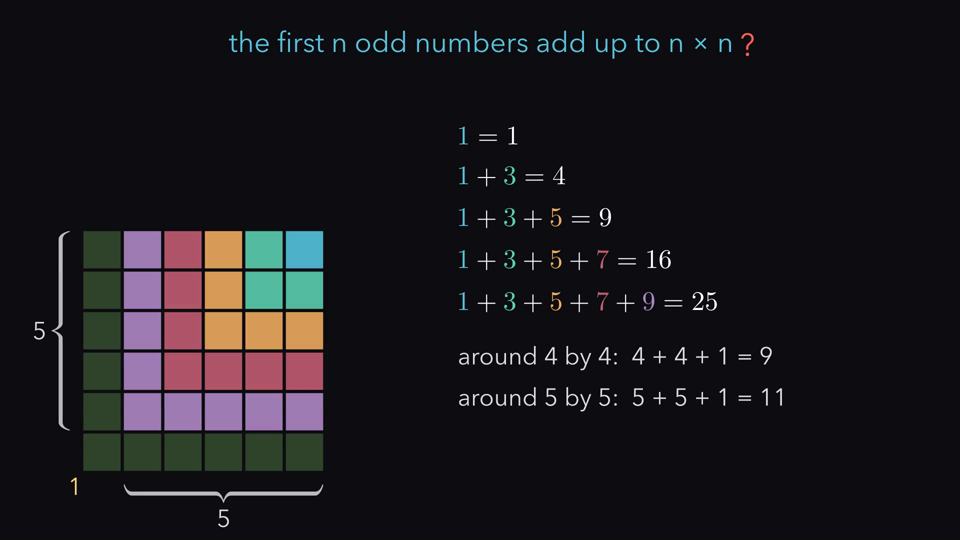
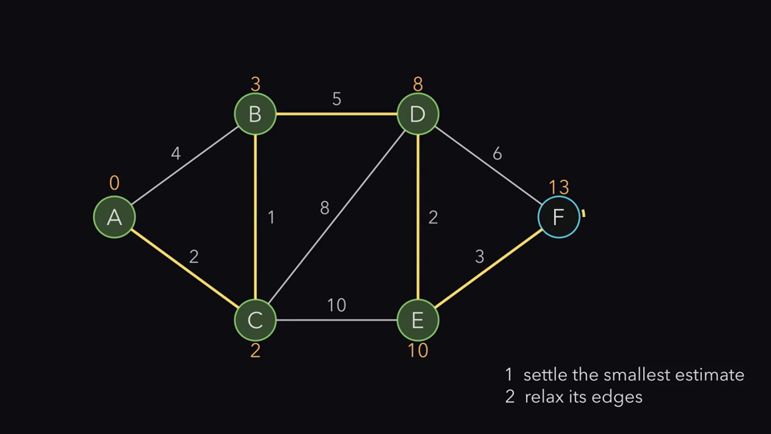
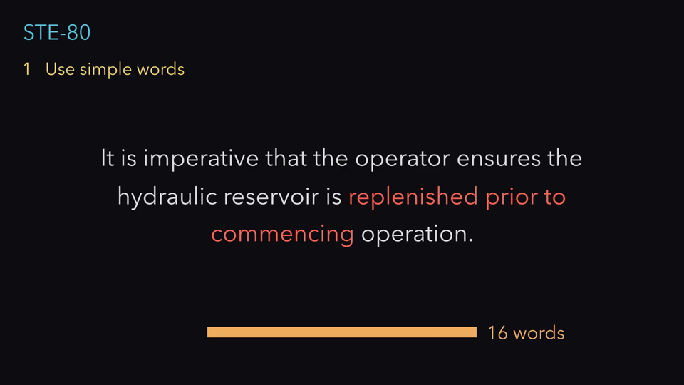

# Explainer

[](https://github.com/ifrit98/Explainer/actions/workflows/ci.yml)
[](https://github.com/ifrit98/Explainer/releases)
[](LICENSE)
[](https://ifrit98.github.io/Explainer/)
[](#install)

**An explanation compiler for Claude Code.** Ask a question. The agent builds a small semantic model of the subject, writes the path a first-time reader takes through it, and compiles both into the simplest representation that keeps the important structure: controlled prose, a diagram, an interactive page, or a 3Blue1Brown-style video with synchronized narration. Then it checks the result against the model, and has fresh agents read it cold.

The video pipeline runs on one machine: Manim for animation, a local Kokoro voice, and no API keys.

<table>
<tr>
<td width="50%"><a href="explainers/softmax-temperature/video/out.mp4"></a></td>
<td width="50%"><a href="explainers/odd-squares/video/out.mp4"></a></td>
</tr>
<tr>
<td><sub><a href="explainers/softmax-temperature/"><b>Softmax temperature</b></a>: one value, T, drives every object. <a href="explainers/softmax-temperature/video/out.mp4">Video with narration, 93 s</a>.</sub></td>
<td><sub><a href="explainers/odd-squares/"><b>Odd numbers make squares</b></a>: compiled beat by beat from a <a href="explainers/odd-squares/narrative.md">narrative</a>. <a href="explainers/odd-squares/video/out.mp4">Video with narration, 4 min 21 s</a>.</sub></td>
</tr>
</table>

**[Live site: videos that stop for your prediction, and interactive pages](https://ifrit98.github.io/Explainer/)** · Inspired by [Andrej Karpathy's post](https://x.com/karpathy/status/2105819303471976479) on understanding LLM output through richer formats.

## Install

In Claude Code:

```text
/plugin marketplace add ifrit98/Explainer
/plugin install explainer@explainer
```

Then ask:

```text
/explainer:explain how does a bloom filter work
/explainer:video why the derivative of sin is cos
/explainer:verify bloom-filter
```

The plugin adds an `explainer` command that runs the toolkit through [uv](https://docs.astral.sh/uv/). Stages 1–3 need nothing else. Video also needs Cairo, Pango, and FFmpeg (`brew install cairo pango pkgconf ffmpeg`) and a one-time `explainer setup` for the local voice. Details: [getting started](docs/getting-started.md).

## How it works

Most explanations fail by omission, not by error: a formula with no reason for its form, a guarantee never shown to break, a symbol used before anyone said what it means. Explainer separates the work into three passes, and checks each one.



1. **Model** (`model.md`, `model.yaml`): the entities, the causal chain, every number a rendering shows, and the **claims** a reader must take away. A *why* claim needs the simplest alternative failing; a *guarantee* needs a case where it holds and one where it breaks.
2. **Stage**: the lowest rung that keeps the structure. If five sentences explain it, the answer is five sentences.

   | Stage | Use when the subject is mainly… | Escalate when… |
   |---|---|---|
   | **1 · Prose** | a procedure, a definition, an argument | — |
   | **2 · Diagram** | topology, flow, architecture | the reader must hold 3+ relationships at once |
   | **3 · Interactive** | a parameter, scenarios, drill-down | the reader must explore states or alternatives |
   | **4 · Video** | a transformation over time | understanding depends on seeing A become B |

3. **Narrative** (`narrative.md`): the question and the result in words, a reason to care, a reason for the approach, an introduction ledger for every term, symbol, and color, and the beats in order. This is where an explainer gets its power, more than from the animation.

Every rendering is compiled from the same model and narrative, so prose, diagram, page, and video use the same terms and numbers.

## Examples

| | |
|---|---|
| [](https://ifrit98.github.io/Explainer/explainers/softmax-temperature/) | **[Softmax temperature](explainers/softmax-temperature/)**: one model rendered as [prose](explainers/softmax-temperature/explanation.md), [diagrams](explainers/softmax-temperature/diagram.md), an [interactive page](https://ifrit98.github.io/Explainer/explainers/softmax-temperature/), and a [narrated video](explainers/softmax-temperature/video/out.mp4). Why exp (divide by the sum instead and owl gets −0.4), why divide by T, and entropy as average surprise. |
| [](explainers/odd-squares/video/out.mp4) | **[Odd numbers make squares](explainers/odd-squares/)** (proof): each odd number is an L that grows the square by one, and each L is two bigger than the last. The reference for the narrative pass: [narrative](explainers/odd-squares/narrative.md), [cold-read record](explainers/odd-squares/review/understanding.md). |
| [](explainers/dijkstra/video/out.mp4) | **[Dijkstra's shortest paths](explainers/dijkstra/)** (algorithm): the run in `model.yaml`, replayed. Why the smallest estimate settles first, why a settled estimate is final, one step at a time, and a negative edge that breaks it. [Blind-test results](explainers/dijkstra/review/understanding.md). |
| **[Why a CDN makes a request faster](https://ifrit98.github.io/Explainer/explainers/cdn-request/)** (interactive) | Two distance sliders and three paths side by side (no CDN, miss, hit). The instrument opens only after you predict the no-CDN time. |
| [](explainers/ste-80/video/out.mp4) | **[STE-80 rewrite](explainers/ste-80/)** (video): one manual sentence through three Simplified Technical English rules, 16 → 9 words. |
| **[git bisect](explainers/git-bisect/explanation.md)** (prose) · **[git objects](explainers/git-objects/diagram.md)** (diagram) | The router at work: a procedure gets numbered steps; pure topology gets one diagram. |

All examples, with the reason for each stage: [`explainers/`](explainers/).

## Checked, not trusted

Every check below has caught a real problem in this repo. Each finding then became a rule for every new explanation, not only a fix to one example.

| Check | When | Catches | It found |
|---|---|---|---|
| `explainer probe` | before rendering | what the model omits: a formula with no why, a guarantee with no failure case, an undefined term | the first softmax model never said why it uses exp |
| `explainer coldread` | on the narrative before rendering, on each rendering after | every word, symbol, or picture a first-time reader meets before it is introduced; things shown but never said; leaps | odd-squares used "the n-th L" without saying what n is, and never said its own result aloud |
| `explainer check` | always; CI | a number the model does not contain, a stale page, an incomplete or uncovered claim, a second name for one concept, a symbol the narrative never introduces, a Mermaid block that does not render (`--diagrams`) | Dijkstra's narration called a value that can still drop a "distance" |
| `explainer render` · `review` | every video render | text that overlaps, touches, or leaves the frame; a key claim with no pause; narration over one picture for too long; a repeated line | Dijkstra said "D is ten" while the screen showed 8; two softmax labels touched |
| `explainer quiz` | before publishing | what a fresh reader understood, scored against the model's quiz and claims | passed the softmax prose and failed a deliberately broken copy |

The blind test and the cold read measure different things. The old odd-squares video passed the blind test (a capable reviewer fills gaps from context) and failed the cold read. The [authoring guide](docs/authoring.md#the-narrative-pass-odd-squares) tells the whole story, including how the narrative's cold read changed the proof itself.

## Narration that drives the animation

```python
class Softmax(ExplainerScene):
    def construct(self):
        T = ValueTracker(1.0)   # drives the dots, bars, and numbers
        ...
        self.predict("When T rises to 2, does cat stay the most likely token?")
        with self.voiceover(text="Now raise the temperature. <bookmark mark='hot'/> At T equal to two, "
                                 "the logits move together."):
            self.wait_until_bookmark("hot")
            self.play(T.animate.set_value(2.0), run_time=3)
```

The animation starts exactly when the voice reaches the bookmark. Local TTS engines give no word timings, so the usual fix is a second pass with Whisper. Here the Kokoro service synthesizes each sentence and each bookmark segment separately and records where each one starts, so bookmark and caption times are exact. `self.predict` dims the frame and asks a question; web players stop there until the viewer commits a prediction. [How it works](docs/video-pipeline.md).

## Inspiration

This project started from [a post by Andrej Karpathy](https://x.com/karpathy/status/2105819303471976479) (October 2026). The post proposes a ladder of output formats for understanding what language models produce, each rung "even better" than the last: **writing** in ASD-STE100 softened to "80% of the way" (here: STE-80), **diagrams**, **web pages** ("in HTML"), and **explainer videos** ("a 3b1b style video explainer on X", narrated with a free local voice). Its closing point is the project's premise: as code gets cheap, it makes sense to ask for "large, custom, discardable software artifacts". Explainer turns the ladder into a workflow, and adds the checks.

## Writing style: STE-80

Prose and narration use STE-80, a house style based on [ASD-STE100](https://www.asd-ste100.org/). It applies about 80% of the rules and skips the dictionary check.

> ~~It is imperative that the operator ensures the hydraulic reservoir is replenished prior to commencing operation.~~
> Fill the hydraulic reservoir before you start the machine.

One idea per sentence, active voice, one term per concept, and direct causal statements ("A causes B because C"). [Rules](plugin/skills/explain/references/writing.md).

## What is in the box

| | |
|---|---|
| **Plugin** · [`plugin/`](plugin/) | Skills [`explain`](plugin/skills/explain/SKILL.md), [`video`](plugin/skills/video/SKILL.md), [`verify`](plugin/skills/verify/SKILL.md); the [principles](plugin/skills/explain/references/principles.md); playbooks for [writing](plugin/skills/explain/references/writing.md), [diagrams](plugin/skills/explain/references/diagrams.md), [HTML](plugin/skills/explain/references/html.md), and [video](plugin/skills/explain/references/video.md). |
| **Toolkit** · [`explainer_kit/`](explainer_kit/) | The `explainer` CLI, the model check, the probe and cold-read prompts, `ExplainerScene` (voice sync, timeline, layout and pace checks, predict pauses), reusable components, word morphs, the Stage 3 web toolkit, and templates. |
| **Docs** · [`docs/`](docs/README.md) | [Getting started](docs/getting-started.md), [concepts](docs/concepts.md), [authoring guide](docs/authoring.md), [model reference](docs/model-reference.md), [video pipeline](docs/video-pipeline.md), [web toolkit](docs/web-toolkit.md), [CLI](docs/cli.md), [troubleshooting](docs/troubleshooting.md). |

## Requirements

- [Claude Code](https://claude.com/claude-code) for the agent workflow (Stages 1–4).
- For video: Python 3.11–3.13 via `uv`, Cairo, Pango, pkg-config, FFmpeg. Optional: SoX; LaTeX for `MathTex` (a user-level TinyTeX works; see [troubleshooting](docs/troubleshooting.md)).
- `explainer check --diagrams` needs Node (it runs the pinned Mermaid CLI with `npx`).
- Tested on macOS (Apple silicon). CI runs the tests, the checks, and a draft render on Ubuntu.

## Related

- [showtime](https://github.com/FavioVazquez/showtime): a broader local video studio plugin for coding agents (HTML motion graphics, footage editing, music). It works alongside this repo; see [video playbook §7](plugin/skills/explain/references/video.md#7-optional-showtime).
- [Manim Community](https://www.manim.community/) · [manim-voiceover](https://github.com/ManimCommunity/manim-voiceover) · [Kokoro-82M](https://huggingface.co/hexgrad/Kokoro-82M)

## Roadmap

What is done, what is next, and what the reviews found: [ROADMAP.md](ROADMAP.md). Release notes: [CHANGELOG.md](CHANGELOG.md) and [releases](https://github.com/ifrit98/Explainer/releases). Contributing: [CONTRIBUTING.md](CONTRIBUTING.md).

## License

[MIT](LICENSE). Third-party components keep their own licenses: Manim and manim-voiceover (MIT), Kokoro-82M weights (Apache-2.0), kokoro-onnx (MIT), FFmpeg (LGPL/GPL). The Kokoro model files are downloaded by `explainer setup` and are not part of this repository.
