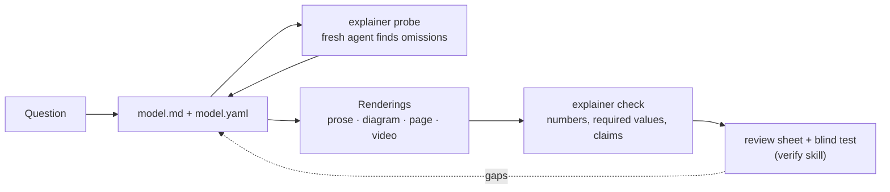

# Documentation

| If you want to… | Read |
|---|---|
| install the plugin and make a first explainer | [Getting started](getting-started.md) |
| understand the idea: model first, four stages, checks | [Concepts](concepts.md) |
| write an explanation that does not omit the important connections | [Authoring guide](authoring.md) |
| look up `model.md` sections, `model.yaml` keys, claims, and check messages | [Model reference](model-reference.md) |
| build a narrated video | [Video pipeline](video-pipeline.md) |
| build an interactive page | [Web toolkit](web-toolkit.md) |
| look up a command | [CLI reference](cli.md) |
| fix an error | [Troubleshooting](troubleshooting.md) |
| contribute an example or a change | [Contributing](../CONTRIBUTING.md) |

What changed between releases: [CHANGELOG](../CHANGELOG.md). What is next: [ROADMAP](../ROADMAP.md).

## The workflow on one page

The agent runs this through three skills: `explain` (the whole pipeline), `video` (Stage 4 directly), and `verify` (the checks before shipping). Their rules are in [`principles.md`](../plugin/skills/explain/references/principles.md).
