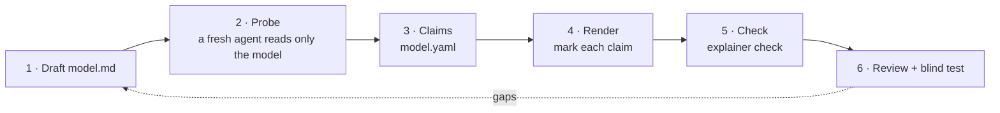

# Authoring guide: complete explanations

Most bad explanations are not wrong. They are incomplete. They state a formula and never say why it has that form. They state a guarantee and never show it hold or fail. They use a term before they define it. The reader can repeat the explanation, but cannot predict anything with it.

This guide is the method Explainer uses to prevent that. It follows one example, `softmax-temperature`, from first draft to a checked, tested explanation.

## The method



### 1. Draft the model

Fill `model.md` from the template. Pay most attention to the four sections that prevent omissions:

- **Why this form.** For each operation, name the simplest alternative and show it failing with numbers.
- **Concrete cases.** For each guarantee, a case with numbers where it holds and a case where it breaks without its assumption. For each mechanism step, a worked example.
- **Terms.** Every term a rendering will use, defined in the order a reader meets it.
- **Scope.** What you leave out, with a pointer.

### 2. Probe the model

```bash
explainer probe softmax-temperature
```

This prints a prompt for a fresh agent that reads only `model.md` and lists what it omits, against five rules: why this form, guarantees with two cases, terms, worked examples, and the next five questions a learner would ask. Run it with a subagent that has no other context.

**Evidence that this works.** The first version of `softmax-temperature` stated `p = exp(z/T) / Σ exp(z/T)` and never said why exp. Its blind test, run on the finished prose, reported the gap only as a side note. The probe, run on the model alone, made it the first finding, with a counterexample in numbers: dividing the logits 2.0, 1.0, 0.5, −1.0 by their sum gives owl −0.4. It also found that with that alternative, T cancels and temperature does nothing. On `dijkstra`, the probe found the missing negative-edge counterexample and proposed the same graph a human would (A→B 2, A→C 3, C→B −2).

**Treat probe numbers as suggestions.** Recompute every number before you use it. In the softmax run, the probe gave two different values for the same probability (2 × 10⁻⁴ and 6 × 10⁻⁶); the correct one is 6.0 × 10⁻⁶. It also rounded 2^1.46 to 2.75; the correct value is 2.76.

**Triage the findings.** Each finding becomes one of three things: a claim (it belongs in the explanation), a Scope entry (it is a fair question you deliberately leave out), or nothing (it is wrong or irrelevant). For softmax, "why exp" became a claim; "which T to choose" and "top-k and top-p order" became Scope entries.

### 3. Write the claims

Turn each idea the reader must take away into a claim in `model.yaml`. The kind decides the required fields ([model reference](model-reference.md#claims)):

```yaml
- id: why-exp
  kind: why
  about: [exp, softmax]
  statement: "exp turns every logit into a positive weight, keeps the order, and turns a gap into a ratio."
  alternative: "Divide each logit by the sum of the logits (or square them, then normalize)."
  counterexample: "The sum is 2.5, so owl gets −0.4; with z/T, T cancels. Squares give owl 0.16 > fox 0.04."
  ask: "Why does softmax use exp, instead of dividing by the sum of the logits?"
```

`explainer check` also reads `model.md` for named functions (exp, log, sqrt, sigmoid, …). A function with no `why` claim fails the check, unless you list it in `accept_unjustified` with a reason. This rule is what would have caught "why exp" without a probe.

### 4. Render, and mark each claim

Present each claim in each rendering it belongs to, and mark the place:

```markdown
<!-- claim: why-exp -->
## Why exp
```

```html
<section data-claim="why-exp"> … </section>
```

```python
self.claim("why-exp")   # in the scene, at the moment the idea is shown
```

A good rendering of a claim shows its case, not only its statement. In the softmax page, the reader picks "divide by the sum" and sees owl at −0.400; then moves T and sees nothing change. In the Dijkstra video, the finality claim is shown at the moment B is settled, with the actual numbers on screen (D 10, E 12, F ∞, all ≥ 3).

### 5. Check

```bash
explainer check softmax-temperature
```

The check fails until every claim is complete, every rendering covers its claims, and every visible number is a model value. Its output is a work list: in the softmax update it listed 17 missing coverages across four renderings, and each fix removed a line.

### 6. Review and blind test

For video, read the review sheet (`explainer render <slug> --review`). Claim marks appear on it, so you can see what is on screen when each idea is presented. In the Dijkstra update, the sheet showed that the narration said "D is ten" while the screen showed D = 8: the finality segment ran one step too late. No automatic check could see that; the sheet made it visible.

Then run the blind test (`explainer quiz <slug> --rendering <r>`, the `verify` skill). Claims with an `ask` field become quiz questions, and the rubric expects the statement and its cases. The reviewer also returns an **audit**: concepts named by two words, numbers shown without a meaning, steps stated without a why, and (for video) points the narration rushes past.

### 7. Turn each finding into a rule

A gap fixed only in one example comes back in the next one. For each real finding, ask which check, probe rule, or template line would have caught it in any explanation, and add that too. The v0.3.0 blind tests left three findings. Each one became a general rule in v0.4.0:

| Finding (one example) | General rule (every explanation) | Where it lives |
|---|---|---|
| Dijkstra's narration said "A has distance zero" for a value that can still drop; the model calls it an *estimate* and keeps *distance* for the final value. | One concept, one word. Close concepts get different words, and the wrong phrases are listed. | `terms` in `model.yaml` (checked); probe rule 3; blind-test audit `terms`; writing rules |
| Softmax showed "entropy 1.46 bits" with only "≈ 2.76 choices"; `log` was excused with `accept_unjustified`. | Every quantity has a meaning, at a low value and a high one. A function excused without a why is a debt, listed by `check -v`. | probe rule 6; audit `unexplained`; template Terms section; softmax now has a `why-entropy` claim |
| Dijkstra's finality argument ran 12 s over one picture, with half a second before the next line. | Every key claim gets time: one picture per step, and a pause after the claim. | `render` and `review` report pace issues from the timeline; storyboard template |
| The landing page played videos with a plain `<video>`, which skipped the predict pauses. | A page that embeds a video with predict pauses plays it with `Explainer.video`. | `explainer check` |
| Mermaid blocks were checked by hand in a browser. | Every Mermaid block renders once before delivery. | `explainer check --diagrams`; CI |

## A catalog of common omissions

| Omission | Symptom in a blind test | Fix |
|---|---|---|
| A formula with no why | The reader can compute but asks "why this?" | `why` claim with the simplest alternative failing |
| A guarantee with no failure case | The reader cannot say what the assumption is for | `guarantee` claim with a counterexample |
| A rule with no motivation | The reader follows the steps but cannot say why this order | `why` claim: what goes wrong in another order (Dijkstra: settling B at 4) |
| An abstract proof | "The proof is abstract and fast" | Show the proof's step with this example's numbers |
| An undefined term | The reader skips or misreads it | Define it in Terms and in the rendering, before first use |
| A silent boundary | The reader's next question has no answer | Scope entry with a pointer |
| Mismatched words and picture | Narration says one value, the screen shows another | Read the review sheet; move the segment to the right moment |
| One concept, two names | The reader treats "estimate" and "distance" as the same thing, or as two things | `terms` entry with the phrases to avoid |
| A number with no meaning | The reader can quote "1.46 bits" but cannot say what it tells them | Say what the number means, at a low and a high value; if it uses a function, a `why` claim |
| A rushed claim | "The finality segment is quick" | One line and one picture per step; a pause after the claim (pace issues) |

## Scope is not an omission

A complete explanation is not an exhaustive one. The softmax explanation leaves out top-k and top-p filtering, and the Dijkstra explanation leaves out running time. Both list these under Scope with a pointer. The goal is that every important question a learner asks lands somewhere: in the explanation, or in an explicit "not covered here, see …".
