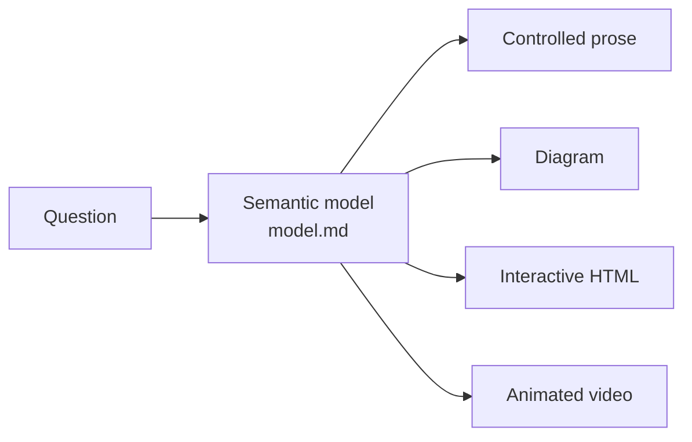

# Concepts

> The four-format ladder (STE-style writing → diagrams → HTML → 3b1b-style videos) comes from [Andrej Karpathy's post](https://x.com/karpathy/status/2105819303471976479). This repo adds the shared semantic model, the routing rules, and the toolchain.

## The explanation compiler

Most explanations are written once, in one format. Explainer separates two jobs:

1. **Reason about the subject.** Build a small semantic model: entities, relationships, causal and temporal links, quantities, alternative states, and the status of each claim.
2. **Render the model.** Compile it into the format that makes the structure easiest to see.

The model is the single source of truth. If a rendering needs a fact, the fact goes into the model first. This keeps four renderings from becoming four different explanations that subtly disagree.

[`explainers/softmax-temperature/`](../explainers/softmax-temperature/) shows this directly: one `model.md`, rendered at all four stages, with the same numbers everywhere.

## The semantic model

Each `model.md` uses one template ([`explainer_kit/templates/model.md`](../explainer_kit/templates/model.md)):

| Section | Question it answers |
|---|---|
| Central question | What does the explanation answer, in one sentence? |
| Entities | What are the minimum concepts, defined in one sentence each? |
| Relationships, dependencies | What interacts? What must be understood first? |
| Causal chain, temporal sequence | What causes what? In what order? |
| Quantities | Which numbers, equations, and thresholds matter? |
| Alternative states | Which cases or scenarios behave differently? |
| Epistemic status | What is observed, derived, assumed, estimated, disputed? |
| Confusion points | What do readers usually get wrong? |
| Representation decision | Which stage, and why? |

## The model is checked, not trusted

Each explainer also has `model.yaml`: the values its renderings show, numbers the renderings may use for structure (`allow`), values each rendering must show (`require`), and quiz items for the blind test.

`explainer check` reads every rendering the way a reader meets it and fails when:

- a reader sees a number that the model does not contain (at the precision shown: 0.84 matches 0.842; 2 does not stand for 2.5);
- a rendering omits a value that `require` lists;
- a page embeds an out-of-date copy of the model.

Scenes and pages can also read the model directly (`load_model(__file__)` in Python, `Explainer.model` in a page). Then they cannot drift. In the tests, changing one logit in `softmax-temperature/model.yaml` makes the check fail on the prose and the diagram until both are updated, and flags the page until it is re-synced.

## Complete the chain

An explanation can pass every number check and still omit the idea that makes it click. The first softmax prose stated `p = exp(z/T) / Σ exp(z/T)` and never said why exp. So the model also records **claims**: the ideas a reader must take away, each with the evidence it needs.

- A **why** claim names the simplest alternative and shows it failing (dividing by the sum of the logits gives owl −0.4, and T cancels).
- A **guarantee** shows a case where it holds and a case where it breaks without its assumption (Dijkstra with C→B −2 answers 2 for a true distance of 1).
- A **mechanism** has a worked example in numbers.
- Each concept has **one word** (`terms`), each quantity a reader sees has a **meaning**, and in a video each key claim gets **time**: one picture per step and a pause after it.

Renderings mark where they cover each claim, and `explainer check` fails while a claim is incomplete or uncovered, or while `model.md` uses a function (exp, log, sqrt, …) that no claim justifies. Before rendering, `explainer probe` gives the model to a fresh agent that lists what is missing. The [authoring guide](authoring.md) walks through the method on `softmax-temperature`.

## The narrative

A correct, complete model can still lose the reader on the way. The odd-squares video passed its blind test while it used "the n-th L" without saying what n is, and never said its own result aloud. So between the model and the renderings sits a third pass: `narrative.md`, the path a first-time reader takes (principles §11).

- The **question and the result** are said in words early, and answered again at the close.
- A **motive** gives a reason to care, and a reason for the approach.
- An **introduction ledger** lists every term, symbol, name, and visual convention, with the instance that grounds it. `explainer check` fails a scene symbol the ledger does not list.
- **Beats** come in order. Each answers the question the last one raised, says what it shows, and shows what it says.

`explainer coldread` gives the narrative, or any rendering, to a fresh agent that meets it for the first time and reports, in order, every reference it was not given. The blind test measures what a reader understood at the end; the cold read finds where, along the way, a reader was handed something unexplained. The [authoring guide](authoring.md#the-narrative-pass-odd-squares) shows the pass on odd-squares.

## Four stages, and when to escalate

Start with the cheapest representation that can work. Escalate only when the current one forces the reader to do mental work that a richer medium would remove.

| Stage | Medium | Use when the subject is mainly… | Example |
|---|---|---|---|
| 1 | Controlled prose | a procedure, a definition, an argument | [git bisect](../explainers/git-bisect/explanation.md) |
| 2 | Static diagram | topology, flow, architecture, dependencies | [git objects](../explainers/git-objects/diagram.md) |
| 3 | Interactive HTML | a parameter, scenarios, layers, drill-down | [softmax temperature](https://ifrit98.github.io/Explainer/explainers/softmax-temperature/) |
| 4 | Animated video | a transformation: how state A becomes state B | [STE-80 rewrite](../explainers/ste-80/video/out.mp4) |

Three tests decide most cases:

- The reader must hold three or more relationships at the same time → consider a diagram.
- The reader must explore states, parameters, or alternatives → consider an interactive page.
- Understanding depends on seeing how state A becomes state B → prefer animation.

There is also a rule against overbuilding. A richer artifact must reduce cognitive load, ambiguity, memory load, mental simulation, comparison difficulty, or navigation difficulty. If five sentences do the job, the answer is five sentences.

## Progressive disclosure

Anything above Stage 1 is organized in levels:

1. **What is it?**
2. **How does it work?**
3. **Why does it work?**
4. **How is it implemented?** (optional)

An interactive page reveals deeper levels on demand. A video builds them in order.

## STE-80 writing

Prose uses STE-80, a house style based on [ASD-STE100 Simplified Technical English](https://www.asd-ste100.org/). It applies about 80% of the rules and skips the controlled-dictionary check, so it never claims formal STE compliance.

- One idea per sentence. Active voice. Simple present tense.
- Imperative verbs for procedures, with the instruction before the explanation.
- One term per concept. Define each term at first use.
- Noun clusters of three words or fewer. No ambiguous pronouns.
- "use", not "utilize"; "before", not "prior to"; "to", not "in order to".
- Write the direct causal form: "A causes B because C."

| Before | After |
|---|---|
| It is imperative that the operator ensures the hydraulic reservoir is replenished prior to commencing operation. | Fill the hydraulic reservoir before you start the machine. |
| One potential limitation concerns situations in which X may become relatively large compared with Y. | The model fails when X exceeds Y. |

Narration uses the same style. Short sentences sound clear when spoken, and sentence ends are natural sync points. Full rules: [`writing.md`](../plugin/skills/explain/references/writing.md).

## Epistemic clarity

Every non-trivial claim carries a status: observation, established fact, mathematical consequence, assumption, estimate, model output, disputed interpretation, or speculation. Interactive pages show the status as tags and, where practical, expose assumptions as toggles. Examples: the shift-invariance toggle and the "loose description" tag in the [softmax page](https://ifrit98.github.io/Explainer/explainers/softmax-temperature/).

## Predict first

For learners, a result is worth more after a prediction. Pages put a predict gate before each important result: the reader commits a number or a choice, and only then the answer and its explanation appear. Videos call `self.predict(...)`: the frame dims, the narration asks the question, and web players stop there until the viewer commits. See the `cdn-request` page and the `odd-squares` and `dijkstra` videos.

## The understanding test

Before an explanation is done, it is checked against seven questions:

1. Can the reader identify the main objects?
2. Can the reader explain how they relate?
3. Can the reader see the central causal chain?
4. Can the reader predict what changes when an important variable changes?
5. Can the reader separate assumptions from observations?
6. Can the reader rebuild the explanation without the exact wording?
7. Does the representation impose mental simulation that another medium would remove?

A "no" means revise, or escalate one stage.

### Blind understanding test

An author grading their own explanation is a weak test. `explainer quiz <slug> --rendering <r>` prints a prompt for a fresh agent that sees only one rendering. It answers the seven questions plus the model's quiz items, and its answers are scored against `explainer quiz <slug> --rubric`. A test must also be able to fail: in the first run, a deliberately broken copy of the softmax prose (it claimed a high temperature can change which token is first) scored 0 on the quiz item about that claim, while the real prose passed. Results live in `explainers/<slug>/review/understanding.md`.

## Where the rules live

| File | Read by | Contents |
|---|---|---|
| [`plugin/skills/explain/references/principles.md`](../plugin/skills/explain/references/principles.md) | the agent, every explanation | the rules above, in short form (10 principles) |
| [`plugin/skills/explain/`](../plugin/skills/explain/) | the agent, on demand | the pipeline and one playbook per medium |
| [`plugin/skills/video/`](../plugin/skills/video/), [`plugin/skills/verify/`](../plugin/skills/verify/) | the agent, on demand | the Stage 4 procedure; the checks before shipping |
| [`CLAUDE.md`](../CLAUDE.md) | the agent, in this repo | imports the principles; repo layout and commands |
| `docs/` | people | this documentation |
