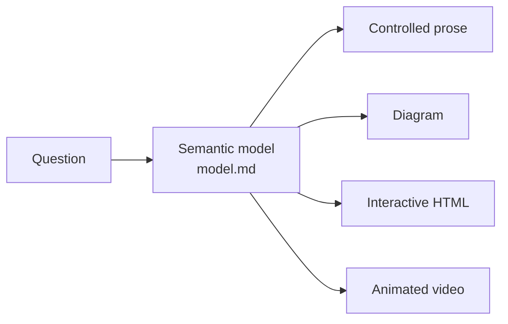

# Concepts

> The four-format ladder (STE-style writing → diagrams → HTML → 3b1b-style videos) comes from [Andrej Karpathy's post](https://x.com/karpathy/status/2105819303471976479). This repo adds the shared semantic model, the routing rules, and the toolchain.

## The explanation compiler

Most explanations are written once, in one format. Explainer separates two jobs:

1. **Reason about the subject.** Build a small semantic model: entities, relationships, causal and temporal links, quantities, alternative states, and the status of each claim.
2. **Render the model.** Compile it into the format that makes the structure easiest to see.

The model is the single source of truth. If a rendering needs a fact, the fact goes into the model first. This keeps four renderings from becoming four different explanations that subtly disagree.

[`explainers/softmax-temperature/`](../explainers/softmax-temperature/) shows this directly: one `model.md`, rendered at all four stages, with the same numbers everywhere.

## The semantic model

Each `model.md` uses one template ([`explainer_kit/templates/model.md`](../explainer_kit/templates/model.md)):

| Section | Question it answers |
|---|---|
| Central question | What does the explanation answer, in one sentence? |
| Entities | What are the minimum concepts, defined in one sentence each? |
| Relationships, dependencies | What interacts? What must be understood first? |
| Causal chain, temporal sequence | What causes what? In what order? |
| Quantities | Which numbers, equations, and thresholds matter? |
| Alternative states | Which cases or scenarios behave differently? |
| Epistemic status | What is observed, derived, assumed, estimated, disputed? |
| Confusion points | What do readers usually get wrong? |
| Representation decision | Which stage, and why? |

## Four stages, and when to escalate

Start with the cheapest representation that can work. Escalate only when the current one forces the reader to do mental work that a richer medium would remove.

| Stage | Medium | Use when the subject is mainly… | Example |
|---|---|---|---|
| 1 | Controlled prose | a procedure, a definition, an argument | [git bisect](../explainers/git-bisect/explanation.md) |
| 2 | Static diagram | topology, flow, architecture, dependencies | [git objects](../explainers/git-objects/diagram.md) |
| 3 | Interactive HTML | a parameter, scenarios, layers, drill-down | [softmax temperature](https://ifrit98.github.io/Explainer/explainers/softmax-temperature/) |
| 4 | Animated video | a transformation: how state A becomes state B | [STE-80 rewrite](../explainers/ste-80/video/out.mp4) |

Three tests decide most cases:

- The reader must hold three or more relationships at the same time → consider a diagram.
- The reader must explore states, parameters, or alternatives → consider an interactive page.
- Understanding depends on seeing how state A becomes state B → prefer animation.

There is also a rule against overbuilding. A richer artifact must reduce cognitive load, ambiguity, memory load, mental simulation, comparison difficulty, or navigation difficulty. If five sentences do the job, the answer is five sentences.

## Progressive disclosure

Anything above Stage 1 is organized in levels:

1. **What is it?**
2. **How does it work?**
3. **Why does it work?**
4. **How is it implemented?** (optional)

An interactive page reveals deeper levels on demand. A video builds them in order.

## STE-80 writing

Prose uses STE-80, a house style based on [ASD-STE100 Simplified Technical English](https://www.asd-ste100.org/). It applies about 80% of the rules and skips the controlled-dictionary check, so it never claims formal STE compliance.

- One idea per sentence. Active voice. Simple present tense.
- Imperative verbs for procedures, with the instruction before the explanation.
- One term per concept. Define each term at first use.
- Noun clusters of three words or fewer. No ambiguous pronouns.
- "use", not "utilize"; "before", not "prior to"; "to", not "in order to".
- Write the direct causal form: "A causes B because C."

| Before | After |
|---|---|
| It is imperative that the operator ensures the hydraulic reservoir is replenished prior to commencing operation. | Fill the hydraulic reservoir before you start the machine. |
| One potential limitation concerns situations in which X may become relatively large compared with Y. | The model fails when X exceeds Y. |

Narration uses the same style. Short sentences sound clear when spoken, and sentence ends are natural sync points. Full rules: [`writing.md`](../.claude/skills/explain/references/writing.md).

## Epistemic clarity

Every non-trivial claim carries a status: observation, established fact, mathematical consequence, assumption, estimate, model output, disputed interpretation, or speculation. Interactive pages show the status as tags and, where practical, expose assumptions as toggles. Examples: the shift-invariance toggle and the "loose description" tag in the [softmax page](https://ifrit98.github.io/Explainer/explainers/softmax-temperature/).

## The understanding test

Before an explanation is done, it is checked against seven questions:

1. Can the reader identify the main objects?
2. Can the reader explain how they relate?
3. Can the reader see the central causal chain?
4. Can the reader predict what changes when an important variable changes?
5. Can the reader separate assumptions from observations?
6. Can the reader rebuild the explanation without the exact wording?
7. Does the representation impose mental simulation that another medium would remove?

A "no" means revise, or escalate one stage.

## Where the rules live

| File | Read by | Contents |
|---|---|---|
| [`CLAUDE.md`](../CLAUDE.md) | the agent, every session | the always-on rules above, in short form |
| [`.claude/skills/explain/`](../.claude/skills/explain/) | the agent, on demand | the pipeline and one playbook per medium |
| [`.claude/skills/video/`](../.claude/skills/video/) | the agent, on demand | the Stage 4 procedure |
| `docs/` | people | this documentation |
