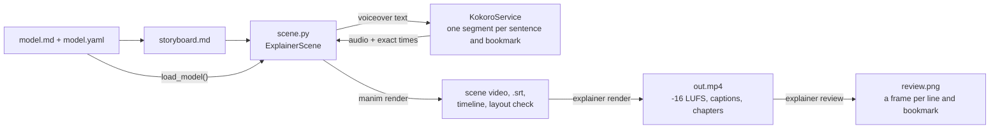

# Video pipeline

Stage 4 explainers follow the 3Blue1Brown model. Objects persist, change shape instead of being replaced, and move in sync with the narration. Everything runs on one machine with no API keys.



| Layer | Tool | License |
|---|---|---|
| Animation | [Manim Community](https://www.manim.community/) | MIT |
| Narration sync | [manim-voiceover](https://github.com/ManimCommunity/manim-voiceover) | MIT |
| Voice | [Kokoro-82M](https://huggingface.co/hexgrad/Kokoro-82M) via [kokoro-onnx](https://github.com/thewh1teagle/kokoro-onnx) | Apache-2.0 / MIT |
| Assembly | FFmpeg | LGPL/GPL |

## Anatomy of a scene

```python
from manim import *
from explainer_kit import ExplainerScene, Role, label

class Gradient(ExplainerScene):
    voice = "af_heart"
    lexicon = {"∇f": "grad f"}          # spoken form; captions keep "∇f"

    def construct(self):
        x = ValueTracker(-2)
        ball = always_redraw(lambda: Dot([x.get_value(), x.get_value() ** 2 / 2 - 1, 0], color=Role.FOCUS))

        with self.voiceover(text="Start at a point on the curve. <bookmark mark='roll'/> "
                                 "Then step against the slope.") as tracker:
            self.play(FadeIn(ball))
            self.wait_until_bookmark("roll")
            self.play(x.animate.set_value(0), run_time=tracker.get_remaining_duration())
```

- **One `with self.voiceover(...)` block per narration statement.** The animations inside the block are the visual evidence for that statement. The block waits for the audio to finish.
- **Time to the voice.** Use `tracker.duration`, `tracker.time_until_bookmark("x")`, `self.wait_until_bookmark("x")`, and `tracker.get_remaining_duration()`. Do not hard-code durations that must match speech.
- **Drive related objects from one `ValueTracker`.** In [`softmax-temperature`](../explainers/softmax-temperature/video/scene.py), one tracker `T` moves the dots, resizes the bars, and updates every number.

## Exact timing without Whisper

manim-voiceover places bookmarks by interpolating word boundaries. Most local TTS engines return no word timings, so the usual fix is to transcribe the audio again with Whisper.

`KokoroService` avoids that step. It splits the text at each `<bookmark mark='…'/>` and at each sentence end, synthesizes every segment separately, joins the segments with short pauses, and records a boundary at the start of each segment. So every bookmark time and every sentence start is an exact sample offset. Captions use the sentence starts too: each caption begins when its sentence begins.

From the `ste-80` render:

```text
"Rule one. Use simple words. <bookmark mark='mark'/> Replenished becomes full. Prior to becomes before. …"
 0.00 s    1.27 s                                    2.81 s                     4.57 s
                                                     ▲ bookmark 'mark'
```

Put bookmarks at clause or sentence boundaries. The timing is exact anywhere, but a split in the middle of a phrase breaks the intonation. STE-80 narration has short sentences, so good bookmark points are frequent.

Pauses between segments: 0.35 s after `. ! ? :`, 0.12 s after `, ; —`, otherwise 0.03 s. Set them with `KokoroService(sentence_pause=…, clause_pause=…)`. Word-level timing inside a sentence is not available: the ONNX Kokoro model returns audio without durations.

## Toolkit reference (`explainer_kit`)

### `ExplainerScene`

A `VoiceoverScene` with the house background and the local voice.

| Attribute | Default | Meaning |
|---|---|---|
| `voice` | `EXPLAINER_VOICE` or `af_heart` | Kokoro voice id (`explainer voices`) |
| `lexicon` | `{}` | written → spoken replacements for TTS only |
| `speed` | `1.0` | speaking rate |

Captions are split at sentence boundaries (then at clauses), up to 70 characters per cue, and each cue starts at its sentence's real audio time.

It also:

- logs a **timeline** of narration lines, bookmarks, and predict pauses (`timeline.json`, used by `explainer review` and by web players);
- runs a **layout check** at every bookmark and at the end of every line: visible text that overlaps other text, text covered by another group's opaque panel, and text outside the frame;
- **fails fast**: an exception during an animation prints its traceback and exits. (Plain manim can hang after such an error.)

### `load_model(__file__)`

Returns the `values` of the explainer's `model.yaml`. A scene that reads its numbers and strings from the model cannot drift from it, and `explainer check` counts it as consistent by construction.

### `self.claim(id)`

Marks the moment the scene presents a claim from `model.yaml`. `explainer check` requires a mark for each claim the video should cover, and the review sheet shows a frame at each mark, so you can see what is on screen when the idea is presented.

### `self.predict(question)`

A predict-first pause. It dims the frame, shows a "Pause and predict" card, speaks the question, and records a predict event. The MP4 gets a chapter at that point, and `Explainer.video()` in the web toolkit stops there and asks for a prediction before it continues.

### Components (`explainer_kit.components`)

| Component | Use |
|---|---|
| `TrackerBars(values_fn, names, colors, grow=None)` | bars whose heights follow a function of trackers; each bar keeps its identity and color |
| `LiveNumber(fn, size, color, place)` | a label redrawn from `fn` every frame; `.freeze()` before you fade or transform it |
| `LabeledNumberLine(x_range, length, labels, axis_name)` | a number line with plain-text tick labels (no LaTeX) |
| `stagger_labels(labels, anchors)` | puts labels next to their anchors and moves colliding labels to a second row |

`softmax-temperature` builds its whole scene from these.

To use a cloud voice instead, override `setup()`:

```python
from manim_voiceover.services.elevenlabs import ElevenLabsService

class MyScene(ExplainerScene):
    def setup(self):
        super().setup()
        self.set_speech_service(ElevenLabsService(voice_name="Adam"))
```

### `Role` — semantic colors

Each color has one meaning for the whole video.

| Role | Color | Meaning |
|---|---|---|
| `ENTITY` | blue | main objects of the model |
| `SECONDARY` | teal | a second class of objects |
| `FOCUS` | yellow | the object the narration is about right now |
| `RELATION` | grey | arrows, axes, connectors |
| `MUTED` | dark grey | context that is present but not in focus |
| `TEXT` | light grey | on-screen text |
| `GOOD` / `BAD` | green / red | correct or preferred / wrong or removed |
| `ASSUMPTION` | purple | assumed, not observed |
| `QUANTITY` | gold | numbers and magnitudes |

When the subject has categorical identities (tokens, classes, players), give each one a fixed color for the whole video, and do not reuse those colors for roles.

### `label(text, size=32, color=Role.TEXT)`

On-screen text in the house font (Avenir Next, with Pango fallback). Uses no LaTeX.

### `words.sentence(text, size=36, width=11)` and `words.morph(old, new)`

`sentence()` lays out text as one group per word, with correct kerning and line wrapping. `morph()` returns animations that rewrite one sentence into another: kept words move, removed words fade out, new words fade in. `removed_words()` and `added_words()` return the changed words so you can color them first.

```python
old = sentence("It is imperative that the operator ensures the reservoir is full.")
new = sentence("Make sure that the reservoir is full.")
self.play(removed_words(old, new).animate.set_color(Role.BAD))
self.play(*morph(old, new))
```

### Speech services

| Class | Use |
|---|---|
| `KokoroService(voice, speed, lang, lexicon)` | default local voice |
| `SilentService()` | silent audio, about 2.6 words per second; used by `--draft` |
| `make_speech_service()` | selects by `EXPLAINER_TTS` (`kokoro` or `silent`); falls back to silent if the model is missing |

Environment variables: `EXPLAINER_TTS`, `EXPLAINER_VOICE`, `EXPLAINER_KOKORO_DIR`.

## Render steps

`explainer render <slug>` does the following:

1. Renders every `class X(ExplainerScene)` in `scene.py`, in file order, with the interpreter that has the toolkit (so it also works from the plugin).
2. Joins the scene videos and shifts each scene's captions and timeline events by its start time.
3. Masters the narration to -16 LUFS integrated, -1.5 dBTP peak (skipped for `--draft`).
4. Muxes the captions as a soft subtitle track and adds a chapter for each predict pause.
5. Writes `captions.srt` and `.vtt`, `timeline.json`, and `contact.png`, and prints any layout issues.
6. With `--review`, builds `review.png`.

Voice clips are cached in `video/media/voiceovers/`. A re-render synthesizes only the lines that changed.

## Review checklist

1. `explainer check <slug>`: narration and labels against `model.yaml`.
2. Read `review.png`: one frame at each line, bookmark, and predict pause, with the spoken text under it and layout issues in red. Each frame must show the evidence for its line.
3. Fix every layout issue. The check does not see text crossing lines or arrows; look for that in the frames.
4. Read `captions.srt` against the narration.
5. Check each claim frame: does the screen show the claim's case at that moment? In `dijkstra`, the narration said "D is ten" while the screen showed D = 8; only the frame showed it.
6. For a published video, run the blind understanding test (the `verify` skill). Results so far: [`dijkstra`](../explainers/dijkstra/review/understanding.md).

## Pitfalls

- **Fading a live label while its text changes.** `FadeOut` or `Transform` on an `always_redraw` label whose glyph count changes raises `ValueError: zip() argument 2 is shorter than argument 1`. Call `.freeze()` (or `clear_updaters()`) first.
- **LaTeX objects.** `MathTex`, `Tex`, `DecimalNumber`, `Integer`, `BraceLabel`, and `NumberLine(include_numbers=True)` need LaTeX (`Brace` alone does not). `explainer setup` reports whether LaTeX was found; without it, use `label()`, `LiveNumber`, and `LabeledNumberLine`.
- **Labels on moving dots collide.** Use `stagger_labels`, or fade the labels before the dots move and let color carry identity.
- **Tags on a graph sit on an edge.** Put node tags on the outside of the graph (above the top row, below the bottom row).
