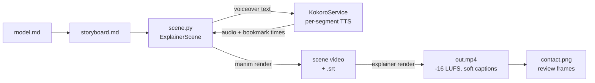

# Video pipeline

Stage 4 explainers follow the 3Blue1Brown model. Objects persist, change shape instead of being replaced, and move in sync with the narration. Everything runs on one machine with no API keys.



| Layer | Tool | License |
|---|---|---|
| Animation | [Manim Community](https://www.manim.community/) | MIT |
| Narration sync | [manim-voiceover](https://github.com/ManimCommunity/manim-voiceover) | MIT |
| Voice | [Kokoro-82M](https://huggingface.co/hexgrad/Kokoro-82M) via [kokoro-onnx](https://github.com/thewh1teagle/kokoro-onnx) | Apache-2.0 / MIT |
| Assembly | FFmpeg | LGPL/GPL |

## Anatomy of a scene

```python
from manim import *
from explainer_kit import ExplainerScene, Role, label

class Gradient(ExplainerScene):
    voice = "af_heart"
    lexicon = {"∇f": "grad f"}          # spoken form; captions keep "∇f"

    def construct(self):
        x = ValueTracker(-2)
        ball = always_redraw(lambda: Dot([x.get_value(), x.get_value() ** 2 / 2 - 1, 0], color=Role.FOCUS))

        with self.voiceover(text="Start at a point on the curve. <bookmark mark='roll'/> "
                                 "Then step against the slope.") as tracker:
            self.play(FadeIn(ball))
            self.wait_until_bookmark("roll")
            self.play(x.animate.set_value(0), run_time=tracker.get_remaining_duration())
```

- **One `with self.voiceover(...)` block per narration statement.** The animations inside the block are the visual evidence for that statement. The block waits for the audio to finish.
- **Time to the voice.** Use `tracker.duration`, `tracker.time_until_bookmark("x")`, `self.wait_until_bookmark("x")`, and `tracker.get_remaining_duration()`. Do not hard-code durations that must match speech.
- **Drive related objects from one `ValueTracker`.** In [`softmax-temperature`](../explainers/softmax-temperature/video/scene.py), one tracker `T` moves the dots, resizes the bars, and updates every number.

## Exact bookmark timing without Whisper

manim-voiceover places bookmarks by interpolating word boundaries. Most local TTS engines return no word timings, so the usual fix is to transcribe the audio again with Whisper.

`KokoroService` avoids that step. It splits the text at each `<bookmark mark='…'/>`, synthesizes each segment separately, joins the segments with short pauses, and records one boundary at the start of each segment. Each bookmark time is therefore the exact sample offset where its segment starts.

```text
"Rule one. Use simple words. <bookmark mark='mark'/> Replenished becomes full. …"
 └──────── segment 1: 0.00–1.81 s ───────┘ pause └──── segment 2: from 2.16 s …
                                                  ▲ bookmark 'mark' = 2.16 s
```

Put bookmarks at clause or sentence boundaries. The timing is exact anywhere, but a split in the middle of a phrase breaks the intonation. STE-80 narration has short sentences, so good bookmark points are frequent.

Pauses between segments: 0.35 s after `. ! ? :`, 0.12 s after `, ; —`, otherwise 0.03 s. Set them with `KokoroService(sentence_pause=…, clause_pause=…)`.

## Toolkit reference (`explainer_kit`)

### `ExplainerScene`

A `VoiceoverScene` with the house background and the local voice.

| Attribute | Default | Meaning |
|---|---|---|
| `voice` | `EXPLAINER_VOICE` or `af_heart` | Kokoro voice id (`uv run explainer voices`) |
| `lexicon` | `{}` | written → spoken replacements for TTS only |
| `speed` | `1.0` | speaking rate |

Captions are split at sentence boundaries (then at clauses), up to 70 characters per cue.

To use a cloud voice instead, override `setup()`:

```python
from manim_voiceover.services.elevenlabs import ElevenLabsService

class MyScene(ExplainerScene):
    def setup(self):
        super().setup()
        self.set_speech_service(ElevenLabsService(voice_name="Adam"))
```

### `Role` — semantic colors

Each color has one meaning for the whole video.

| Role | Color | Meaning |
|---|---|---|
| `ENTITY` | blue | main objects of the model |
| `SECONDARY` | teal | a second class of objects |
| `FOCUS` | yellow | the object the narration is about right now |
| `RELATION` | grey | arrows, axes, connectors |
| `MUTED` | dark grey | context that is present but not in focus |
| `TEXT` | light grey | on-screen text |
| `GOOD` / `BAD` | green / red | correct or preferred / wrong or removed |
| `ASSUMPTION` | purple | assumed, not observed |
| `QUANTITY` | gold | numbers and magnitudes |

When the subject has categorical identities (tokens, classes, players), give each one a fixed color for the whole video, and do not reuse those colors for roles.

### `label(text, size=32, color=Role.TEXT)`

On-screen text in the house font (Avenir Next, with Pango fallback). Uses no LaTeX.

### `words.sentence(text, size=36, width=11)` and `words.morph(old, new)`

`sentence()` lays out text as one group per word, with correct kerning and line wrapping. `morph()` returns animations that rewrite one sentence into another: kept words move, removed words fade out, new words fade in. `removed_words()` and `added_words()` return the changed words so you can color them first.

```python
old = sentence("It is imperative that the operator ensures the reservoir is full.")
new = sentence("Make sure that the reservoir is full.")
self.play(removed_words(old, new).animate.set_color(Role.BAD))
self.play(*morph(old, new))
```

### Speech services

| Class | Use |
|---|---|
| `KokoroService(voice, speed, lang, lexicon)` | default local voice |
| `SilentService()` | silent audio, about 2.6 words per second; used by `--draft` |
| `make_speech_service()` | selects by `EXPLAINER_TTS` (`kokoro` or `silent`); falls back to silent if the model is missing |

Environment variables: `EXPLAINER_TTS`, `EXPLAINER_VOICE`, `EXPLAINER_KOKORO_DIR`.

## Render steps

`uv run explainer render <slug>` does the following:

1. Finds every `class X(ExplainerScene)` in `scene.py` and renders each one in file order.
2. Joins the scene videos with FFmpeg and shifts each scene's captions by its start time.
3. Masters the narration to -16 LUFS integrated, -1.5 dBTP peak (skipped for `--draft`).
4. Muxes `captions.srt` as a soft subtitle track.
5. Writes `contact.png`: one frame every `--every` seconds, with timestamps.

Voice clips are cached in `video/media/voiceovers/`. A re-render synthesizes only the lines that changed.

## Review checklist

1. Read `contact.png`. Check overlaps, legibility, and that objects persist instead of reappearing.
2. For each bookmark, check that the visual evidence is on screen just after it. Bookmark times are in `media/voiceovers/cache.json` (`word_boundaries[].audio_offset`, in units of 10⁻⁷ s).
3. Read `captions.srt` against the narration.
4. Run the understanding test from [concepts](concepts.md#the-understanding-test).

## Pitfalls

- **`FadeOut` on an `always_redraw` group whose glyph count changes.** This raises `ValueError: zip() argument 2 is shorter than argument 1`. Call `group.clear_updaters()` before you fade it out.
- **`DecimalNumber`, `Integer`, `MathTex`, `Tex`, `BraceLabel`, and `NumberLine(include_numbers=True)` need LaTeX.** (`Brace` alone does not.) Without LaTeX, use `always_redraw(lambda: label(f"{v.get_value():.2f}"))` and plain tick labels.
- **Labels on moving dots collide.** Stagger them on two rows, or fade them out before the dots move and let color carry identity.
