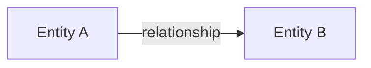

# <Title: the question, in the reader's words>

<!-- Stage 2, rendered from model.md. Use the model's entity names on every node. -->

## Level 1 — What it is

```mermaid
flowchart LR
    A[Entity A] -->|relationship| B[Entity B]
```
