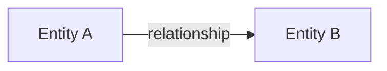

# {{slug}} — Stage 2: diagrams

> Rendered from [`model.md`](model.md). Use the model's entity names on every node.

## Level 1 — What it is

```mermaid
flowchart LR
    A[Entity A] -->|relationship| B[Entity B]
```
