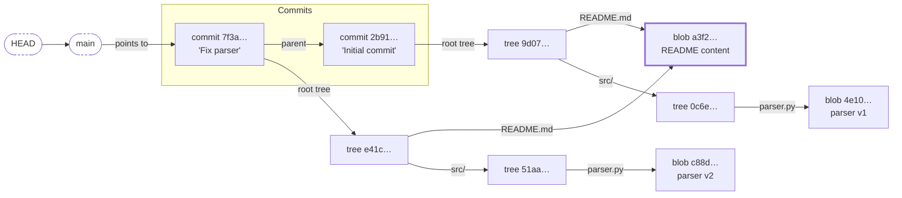

# What git stores when you commit

<!-- Stage 2, rendered from model.md: topology, so one component diagram. -->

If you think of a commit as a diff, git stores something else. **A commit is a full snapshot of the project, and an unchanged file is not stored again.** Git stores four kinds of objects, and each object's ID is the hash of its content. Same content gives the same ID, so the same object; a tree stores the IDs of what it contains, so a changed file changes the ID of every tree above it.

Reading the picture: rectangles are objects, rounded boxes with dashed borders are refs (names that point to an object), and the thick border marks a blob that two trees share. Hashes are shortened and made up.

**Read the diagram:**

1. `HEAD` and `main` are refs: names, not objects.
2. Each commit points to one root tree and to its parent commit.
3. A tree maps names to blobs (files) or to other trees (directories).
4. `README.md` did not change between the commits, so both trees point to the same blob `a3f2…` (thick border).
5. `parser.py` changed, so it has a new blob. Each tree above it stores that new ID, so its own content and ID change too: `src/`, then the root tree, then the commit, which stores its root tree's ID.

| Object | Stores | Points to |
|---|---|---|
| blob | file content only (no name) | nothing |
| tree | names, modes, and the IDs of its entries | blobs and trees |
| commit | its tree's ID, its parents' IDs, author, time, message | one tree; no parent (first commit), one, or several (a merge) |
| tag (annotated) | tagger, message | one object, usually a commit |

**So, is a commit a diff?** No. A commit points to a whole tree. `git show` computes the diff against the parent when you ask. On disk, packfiles compress similar objects against each other, but that is storage, not what a commit means. A commit stores only what changed (new blobs, and new trees on the path to them) because everything else is the same object as before.
