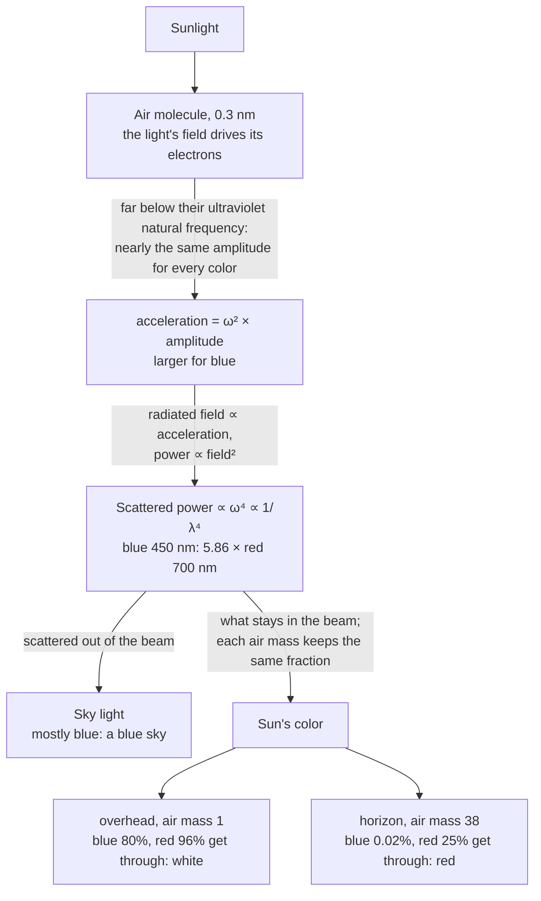
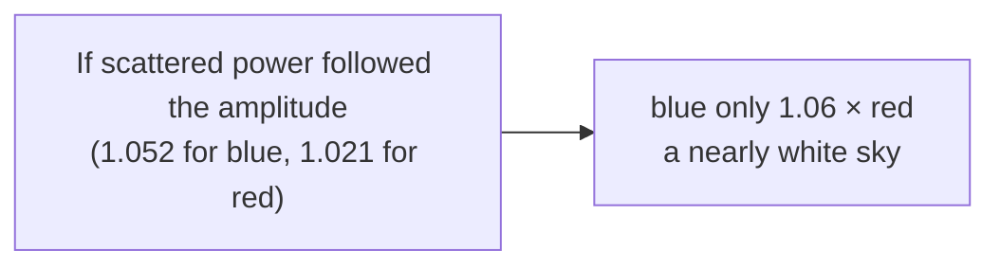

# Why is the sky blue, and the setting Sun red?

<!-- Stage 2, rendered from model.md. Same names as the prose: beam, sky light, scattered power, air mass. -->

**Air molecules scatter blue light about six times more than red. The scattered light is the blue sky; what stays in the Sun's beam is the Sun's color.**

Terms: the *beam* is the light coming straight from the Sun. ω = 2πc / λ is the light's angular frequency, larger for shorter wavelengths. *Air mass* is the length of the beam's path through the air: 1 with the Sun overhead, 38 at the horizon.

<!-- claim: mechanism-dipole -->
<!-- claim: guarantee-path -->

## Why acceleration, not amplitude

<!-- claim: why-acceleration -->

## When the rule fails: large scatterers

<!-- claim: guarantee-small-scatterer -->

A molecule is 1,500 times smaller than the wavelength, so all its electrons move together and their waves add. So the sky is blue because the scatterers are small and their power follows the acceleration; the low Sun is red because a long path removes the blue from its beam.
