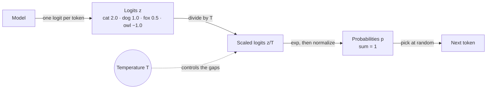
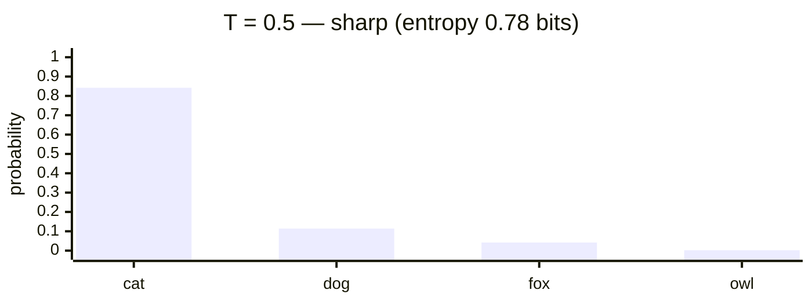
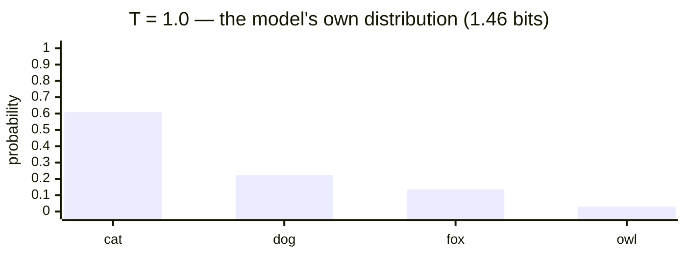
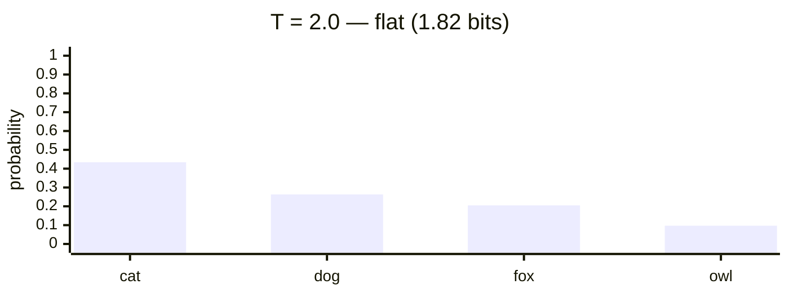
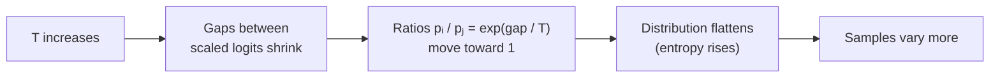
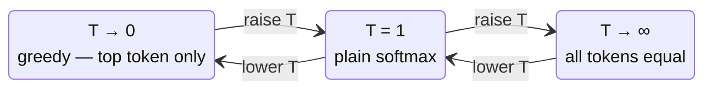

# Softmax temperature — Stage 2: diagrams

> Rendered from [`model.md`](model.md). Other renderings: [prose](explanation.md) · [interactive](index.html) · [video](video/out.mp4).

## Level 1 — Where temperature acts in one decoding step

## Level 2 — What T does to the distribution (same logits, three temperatures)

The ranking is the same in all three charts. Only the spread changes.

## Level 3 — Why: the causal chain

## Limit states

